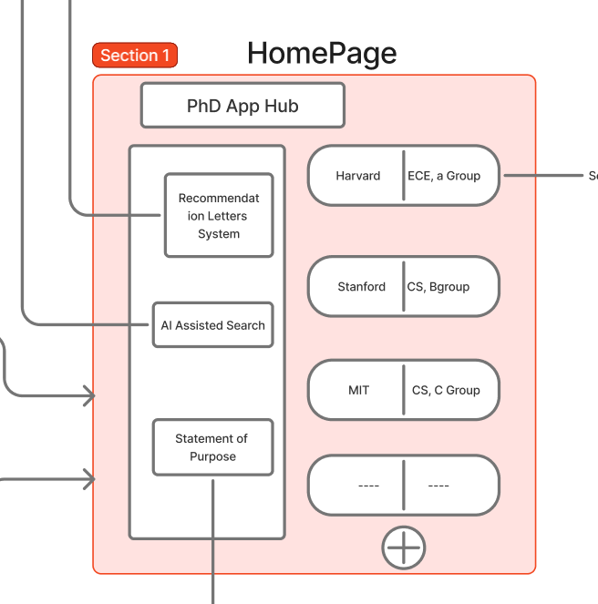
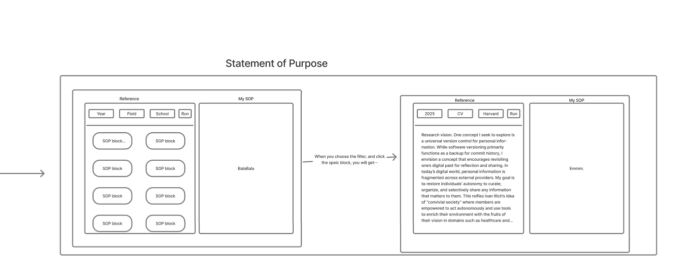
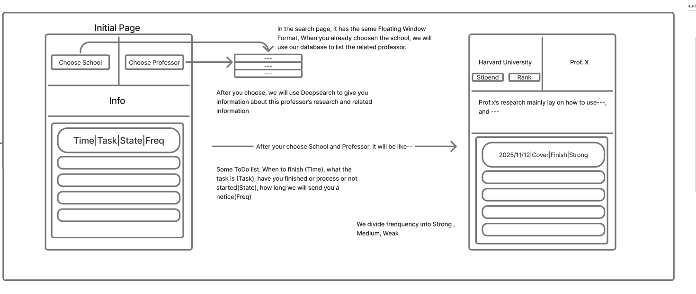
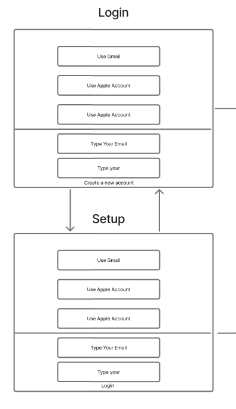

# Module 2 Group Assignment

CSCI 5117, Fall 2025, [assignment description](https://canvas.umn.edu/courses/518559/pages/project-2)

## App Info:

* Team Name: http-200
* App Name: 
* App Link: <https://TODO.com/>

### Students
* Leon Chen, chen9861@umn.edu
* Chunlin Gong, gong0226@umn.edu

## Key Features

**Describe the most challenging features you implemented
(one sentence per bullet, maximum 4 bullets):**

* ...

Which (if any) device integration(s) does your app support?

* ...

Which (if any) progressive web app feature(s) does your app support?

* ...

## Mockup images

**[Add images/photos that show your mockup](https://stackoverflow.com/questions/10189356/how-to-add-screenshot-to-readmes-in-github-repository) along with a very brief caption:**

### Overall Design Mockup

*Complete PhD application management system design overview, integrating all application components and information aggregation features*

### Home Page

*Dashboard showing application overview, pending tasks, and quick access to all PhD application management features*

### Statement of Purpose (SOP)

*SOP management interface for creating, editing, and organizing multiple versions of personal statements for different PhD programs*

### Recommendation Letter

*Recommendation letter tracker for managing requests, tracking submission status, and organizing letters by program and recommender*

### Program Information

*PhD program information aggregator displaying detailed program requirements, deadlines, faculty research areas, and application checklist*

### AI Assisted Features

*AI-powered writing assistant for generating, refining, and optimizing SOP drafts, recommendation letter requests, and other application materials*

### Activity Log

*Application timeline and activity log tracking all PhD application progress, deadlines, submissions, and important milestones*

## Testing Notes

**Is there anything special we need to know in order to effectively test your app? (optional):**

* ...

## Screenshots of Site (complete)

**[Add a screenshot of each key page](https://stackoverflow.com/questions/10189356/how-to-add-screenshot-to-readmes-in-github-repository)
along with a very brief caption:**

## External Dependencies

**Document integrations with 3rd Party code or services here.
Please do not document required libraries (e.g., VUE, Firebase, vuefire).**

* Library or service name: description of use
* ...

**If there's anything else you would like to disclose about how your project
relied on external code, expertise, or anything else, please disclose that
here:**

...
