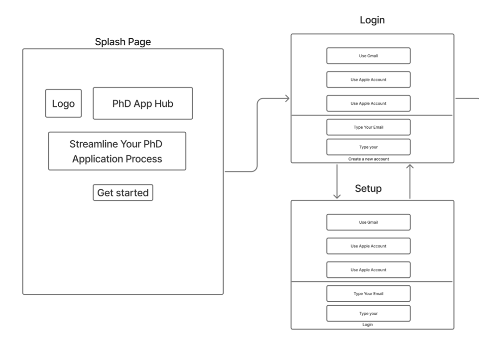
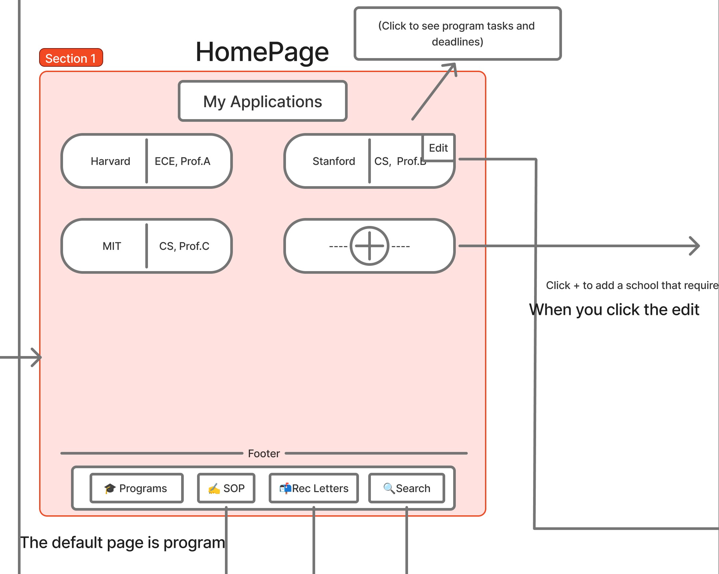
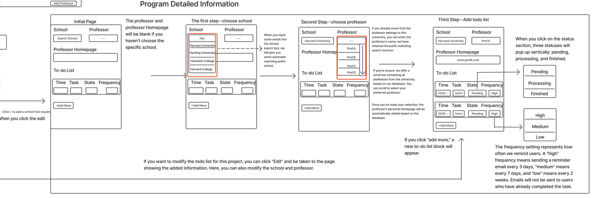
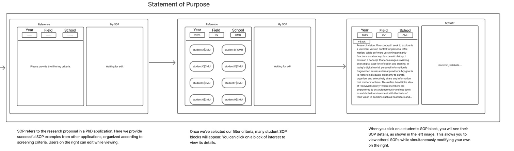

# Module 2 Group Assignment

CSCI 5117, Fall 2025, [assignment description](https://canvas.umn.edu/courses/518559/pages/project-2)

## App Info:

* Team Name: http-200
* App Name: PhDHub
* App Link: <https://TODO.com/>

### Students
* Leon Chen, chen9861@umn.edu
* Chunlin Gong, gong0226@umn.edu

## Key Features

**Describe the most challenging features you implemented
(one sentence per bullet, maximum 4 bullets):**

* ...

Which (if any) device integration(s) does your app support?

* ...

Which (if any) progressive web app feature(s) does your app support?

* ...

## Mockup images

**[Add images/photos that show your mockup](https://stackoverflow.com/questions/10189356/how-to-add-screenshot-to-readmes-in-github-repository) along with a very brief caption:**

### Overall Design Mockup

*Complete PhD application management system design overview*

### Splash Page

*Application timeline and activity log tracking all PhD application progress, deadlines, submissions, and important milestones*

Added a simple splash / landing screen before Login/Setup

-  Gives users a clearer starting point
-  Makes the flow feel more intentional

### Home Page

*Dashboard showing application overview, pending tasks, and quick access to all PhD application management features*

-  Cleaned up the layout so it feels more organized
-  Replaced the old left-side column with a footer navigation bar
   -  Helps users understand how to move between pages
-  Added small labels so the purpose of each button is clearer

### Program Information

*PhD program information page showing program requirements, deadlines, faculty research areas, and application checklist*

- Broke the page into a clear three-step workflow

  -  Choose school (with auto-suggestion)
  -  Choose professor (with fallback if not in database)
  -  Add TODO list

- Redesigned the TODO list so it actually looks like a list of tasks

- Added clear form fields for adding new TODO items

- Added explanations for task frequency and reminder logic

  

### Statement of Purpose (SOP)

*SOP management interface for creating, editing, and organizing multiple versions of personal statements for different PhD programs*

- Added labels showing how users select, edit, and compare SOP drafts

- Clarified what each SOP block represents (draft, version, or reference)

- Improved the editor area so the interaction is easier to understand

### Recommendation Letter

*Recommendation letter tracker for managing requests, tracking submission status, and organizing letters by program and recommender*

### AI Assisted Features

*Intelligent search feature for finding professors, programs, and SOP examples*

Left the structure as-is since this part was already clear

## Testing Notes

**Is there anything special we need to know in order to effectively test your app? (optional):**

* ...

## Screenshots of Site (complete)

**[Add a screenshot of each key page](https://stackoverflow.com/questions/10189356/how-to-add-screenshot-to-readmes-in-github-repository)
along with a very brief caption:**

## Technology Stack & References

### Core Framework
* [Vue 3](https://vuejs.org/) - Progressive JavaScript framework
  * [Vue Composition API](https://vuejs.org/api/composition-api-setup.html) - Used for component logic
  * [Vue Component Events](https://vuejs.org/guide/components/events.html) - Component communication
  * [Vue Props](https://vuejs.org/guide/components/props.html) - Component props
  * [Vue Conditional Rendering](https://vuejs.org/guide/essentials/conditional.html) - Used `v-if` and `v-else` for modal display and expanded card states
* [TypeScript](https://www.typescriptlang.org/) - Typed superset of JavaScript
  * [TypeScript Documentation](https://www.typescriptlang.org/docs/)
* [Vite](https://vitejs.dev/) - Next generation frontend tooling
  * [Vite Guide](https://vitejs.dev/guide/)

### Routing & State Management
* [Vue Router](https://router.vuejs.org/) - Official router for Vue.js
  * [Vue Router Guide](https://router.vuejs.org/guide/) - Used for navigation between login, home, SOP, and other views
* [Pinia](https://pinia.vuejs.org/) - The Vue Store that you will enjoy using
  * [Pinia Core Concepts](https://pinia.vuejs.org/core-concepts/) - Used for managing auth, projects, SOP, and application state

### UI Framework & Styling
* [Tailwind CSS](https://tailwindcss.com/) - Utility-first CSS framework
  * [Tailwind CSS Documentation](https://tailwindcss.com/docs)
* [PostCSS](https://postcss.org/) - CSS tool for transforming styles
  * [PostCSS Documentation](https://postcss.org/docs/)
* [Radix Vue](https://www.radix-vue.com/) - Unstyled, accessible components for Vue
  * [Radix Vue Documentation](https://www.radix-vue.com/getting-started/introduction)
  * Used as the foundation for shadcn-vue components
* [shadcn-vue](https://www.shadcn-vue.com/) - Re-usable components built with Radix Vue and Tailwind CSS
  * Components used: Button, Card, Dialog, Input, Select, Badge, Tooltip, Separator

### UI Utilities
* [clsx](https://github.com/lukeed/clsx) - Tiny utility for constructing className strings
* [tailwind-merge](https://github.com/dcastil/tailwind-merge) - Merge Tailwind CSS classes without style conflicts
* [class-variance-authority](https://cva.style/) - Create type-safe variant APIs for your components

### Backend & Database
* [Firebase](https://firebase.google.com/) - Backend-as-a-Service platform
  * [Firebase Documentation](https://firebase.google.com/docs)
  * [Firebase Firestore](https://firebase.google.com/docs/firestore) - Used for data storage
  * [Firebase Authentication](https://firebase.google.com/docs/auth) - Used for user authentication
  * [Firebase Cloud Functions](https://firebase.google.com/docs/functions) - Used for email sending functionality

### Third-Party Services & Libraries
* [OpenAI API](https://platform.openai.com/docs) - AI service for intelligent search functionality
  * [OpenAI Node.js SDK](https://github.com/openai/openai-node)
* [PDF.js](https://mozilla.github.io/pdf.js/) - PDF rendering library
  * [PDF.js Documentation](https://mozilla.github.io/pdf.js/getting_started/)
  * Used for displaying SOP PDFs in the application
* [md-editor-v3](https://imzbf.github.io/md-editor-v3/) - Markdown editor component for Vue 3
  * [md-editor-v3 Documentation](https://imzbf.github.io/md-editor-v3/docs)

## External Dependencies

**Document integrations with 3rd Party code or services here.
Please do not document required libraries (e.g., VUE, Firebase, vuefire).**

* [CSRankings](https://github.com/emeryberger/CSRankings) - Open-source dataset providing professor and institution data. The application loads professor information from CSRankings data (via `professors.json`) for searching and selecting professors when creating application entries. Website: [csrankings.org](http://csrankings.org/)

* [CS PhD Statements of Purpose](https://cs-sop.notion.site/CS-PhD-Statements-of-Purpose-df39955313834889b7ac5411c37b958d) - Open-source collection of PhD application statements. The application loads SOP examples from CSV data for reference. These examples are displayed in the SOP view and used in the intelligent search feature.

* [OpenAI API](https://platform.openai.com/docs) - Third-party service used for intelligent search functionality. The application uses OpenAI's API to help users find relevant professors, programs, and SOP examples based on natural language queries. User queries are processed and matched against CSRankings professor data and SOP examples to provide recommendations.

**If there's anything else you would like to disclose about how your project
relied on external code, expertise, or anything else, please disclose that
here:**

...
