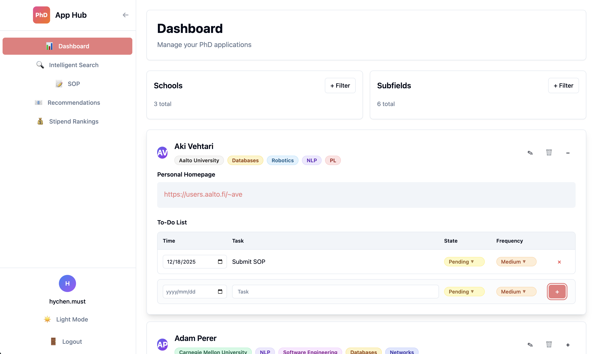
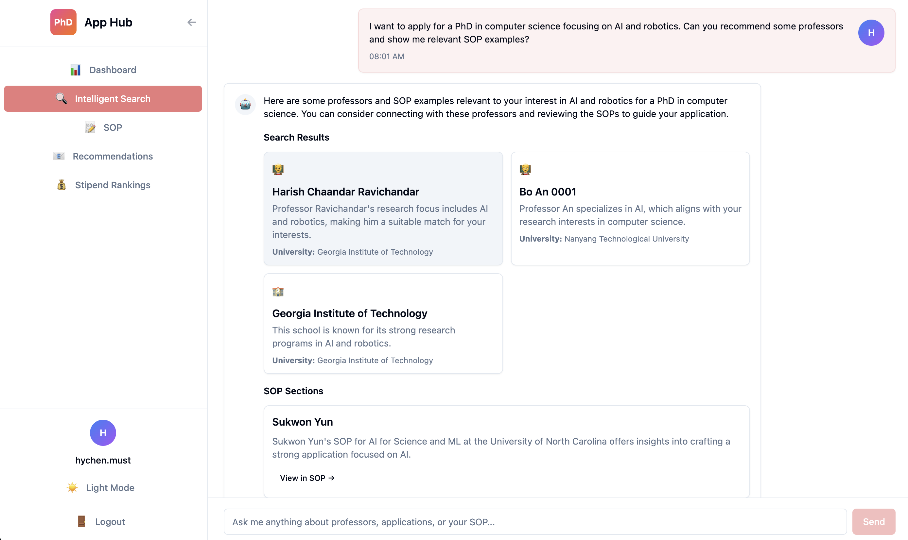
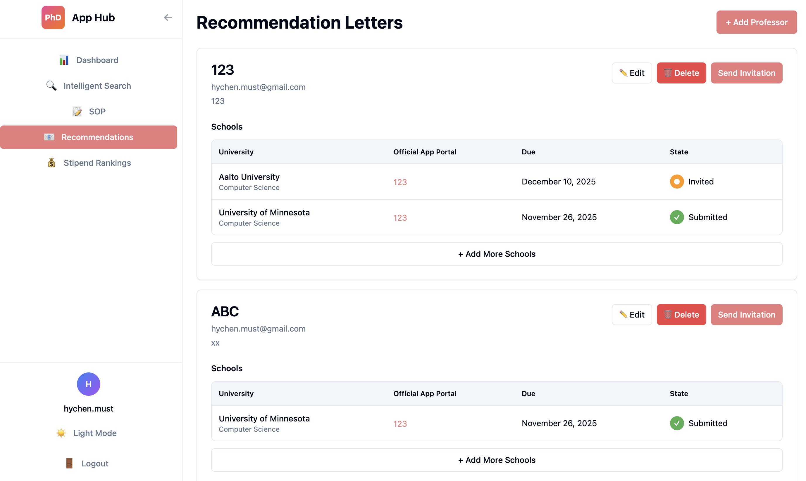
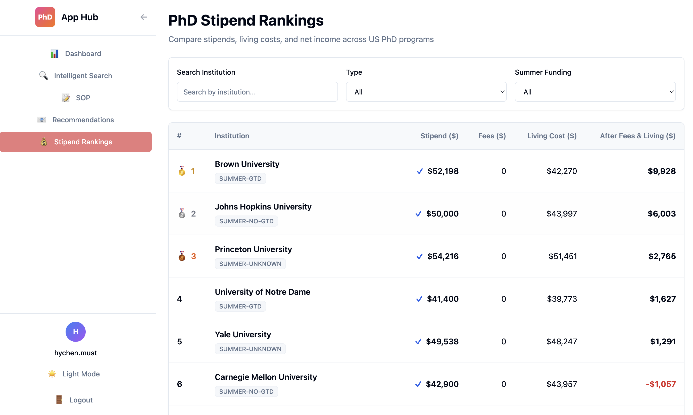

# Module 2 Group Assignment

CSCI 5117, Fall 2025, [assignment description](https://canvas.umn.edu/courses/518559/pages/project-2)

## App Info:

* Team Name: http-200
* App Name: PhD App Hub
* App Link: <https://phd-app-hub-4df7c.web.app>

### Students
* Leon Chen, chen9861@umn.edu
* Chunlin Gong, gong0226@umn.edu

## Key Features

**Describe the most challenging features you implemented
(one sentence per bullet, maximum 4 bullets):**

* **Dashboard, Real-Time Application Management**: Built a responsive dashboard with dynamic filtering by school and subfield, color-coded tags for visual organization, and real-time data synchronization using Firebase Firestore, allowing students to track and manage their entire PhD application portfolio with instant updates across devices.

* **Intelligent Search, AI-Powered Discovery**: Implemented a natural language search system using OpenAI API with multi-path recall that simultaneously searches through CSRankings professor data and SOP reference library, providing contextual recommendations for professors, programs, and writing examples, with seamless navigation to related SOP references.

* **SOP Center, Split-Screen Writing Environment**: Created a resizable dual-panel interface combining a searchable SOP reference library with PDF preview (using PDF.js) on the left, and a full-featured Markdown editor with live preview (Typora-like experience) on the right, featuring auto-save to localStorage and export functionality.

* **Recommendations, Automated Letter Management**: Developed a recommendation letter tracking system integrated with Firebase Cloud Functions that automatically generates and sends invitation emails to professors, tracks submission status across multiple schools, and manages letter assignments with reminder notifications.

Which (if any) device integration(s) does your app support?

None, The app is designed for desktop use only and is optimized for desktop browsers (1920x1080 or larger screens).

Which (if any) progressive web app feature(s) does your app support?

None, The app does not implement Progressive Web App (PWA) features.

## Mockup images

### Overall Design Mockup

*Complete PhD application management system design overview*

### Splash Page

*Application timeline and activity log tracking all PhD application progress, deadlines, submissions, and important milestones*

Added a simple splash / landing screen before Login/Setup

-  Gives users a clearer starting point
-  Makes the flow feel more intentional

### Home Page

*Dashboard showing application overview, pending tasks, and quick access to all PhD application management features*

-  Cleaned up the layout so it feels more organized
-  Replaced the old left-side column with a footer navigation bar
   -  Helps users understand how to move between pages
-  Added small labels so the purpose of each button is clearer

### Program Information

*PhD program information page showing program requirements, deadlines, faculty research areas, and application checklist*

- Broke the page into a clear three-step workflow

  -  Choose school (with auto-suggestion)
  -  Choose professor (with fallback if not in database)
  -  Add TODO list

- Redesigned the TODO list so it actually looks like a list of tasks

- Added clear form fields for adding new TODO items

- Added explanations for task frequency and reminder logic

  

### Statement of Purpose (SOP)

*SOP management interface for creating, editing, and organizing multiple versions of personal statements for different PhD programs*

- Added labels showing how users select, edit, and compare SOP drafts

- Clarified what each SOP block represents (draft, version, or reference)

- Improved the editor area so the interaction is easier to understand

### Recommendation Letter

*Recommendation letter tracker for managing requests, tracking submission status, and organizing letters by program and recommender*

### AI Assisted Features

*Intelligent search feature for finding professors, programs, and SOP examples*

Left the structure as-is since this part was already clear

## Testing Notes

**Is there anything special we need to know in order to effectively test your app? (optional):**

* **Initial Loading**: The app may take a few seconds to load data on first visit (professors, SOP examples, stipend rankings). This is normal behavior.

* **PDF Preview Limitations**: Some SOP reference PDFs may fail to load due to external link availability (Google Drive, GitHub, Overleaf). This is expected behavior as the dataset contains links from various sources that may change over time.

* **Email Functionality**: The recommendation letter email sending feature may not be available if backend services are not configured, but all other recommendation tracking features will work normally.

* **Browser Compatibility**: The app is optimized for modern browsers (Chrome, Firefox, Safari, Edge). PDF preview may have limited support in older browsers.

* **Desktop-Only Design**: The app is designed for desktop use only. For best testing experience, test on desktop browsers with screen resolution of 1920x1080 or larger. The SOP split-screen editor and other features are optimized for desktop viewports.

## Screenshots of Site

### Dashboard, Application Management

*Main dashboard showing all PhD applications with filtering capabilities by school and subfield. Users can create new applications, view application status, and manage their application portfolio. The interface features color-coded tags for schools and research areas, making it easy to visually organize and filter applications.*

### Intelligent Search, AI-Powered Discovery

*Intelligent search interface powered by OpenAI API. Users can ask natural language questions to find professors, programs, and relevant SOP examples. The system performs multi-path recall across CSRankings professor data and SOP reference library, providing contextual recommendations. Search results include clickable cards that can directly navigate to related SOP references or create new application entries.*

### SOP Center, Writing & Reference

*Split-screen SOP writing interface. Left panel displays the SOP Reference Library with searchable examples from successful PhD applicants, including PDF previews. Right panel features a full-featured Markdown editor with live preview mode (Typora-like experience). Users can resize the panels, search for specific SOP examples, view PDF references, and export their work as Markdown files. The editor auto-saves content to localStorage for persistence.*

### Recommendation Letter Management

*Comprehensive recommendation letter tracking system. Users can add recommenders, assign them to specific schools/programs, and manage invitation emails. The system integrates with Firebase Cloud Functions to send automated email invitations. All recommendation letter tasks are tracked with status indicators, ensuring users never miss a deadline. The interface shows recommender details, assigned schools, and task completion status.*

## Technology Stack & References

### Core Framework
* [Vue 3](https://vuejs.org/) - Progressive JavaScript framework
  * [Vue Composition API](https://vuejs.org/api/composition-api-setup.html) - Used for component logic
  * [Vue Component Events](https://vuejs.org/guide/components/events.html) - Component communication
  * [Vue Props](https://vuejs.org/guide/components/props.html) - Component props
  * [Vue Conditional Rendering](https://vuejs.org/guide/essentials/conditional.html) - Used `v-if` and `v-else` for modal display and expanded card states
* [TypeScript](https://www.typescriptlang.org/) - Typed superset of JavaScript
  * [TypeScript Documentation](https://www.typescriptlang.org/docs/)
* [Vite](https://vitejs.dev/) - Next generation frontend tooling
  * [Vite Guide](https://vitejs.dev/guide/)

### Routing & State Management
* [Vue Router](https://router.vuejs.org/) - Official router for Vue.js
  * [Vue Router Guide](https://router.vuejs.org/guide/) - Used for navigation between login, home, SOP, and other views
* [Pinia](https://pinia.vuejs.org/) - The Vue Store that you will enjoy using
  * [Pinia Core Concepts](https://pinia.vuejs.org/core-concepts/) - Used for managing auth, projects, SOP, and application state

### UI Framework & Styling
* [Tailwind CSS](https://tailwindcss.com/) - Utility-first CSS framework
  * [Tailwind CSS Documentation](https://tailwindcss.com/docs)
* [PostCSS](https://postcss.org/) - CSS tool for transforming styles
  * [PostCSS Documentation](https://postcss.org/docs/)
* [Radix Vue](https://www.radix-vue.com/) - Unstyled, accessible components for Vue
  * [Radix Vue Documentation](https://www.radix-vue.com/getting-started/introduction)
  * Used as the foundation for shadcn-vue components
* [shadcn-vue](https://www.shadcn-vue.com/) - Re-usable components built with Radix Vue and Tailwind CSS
  * Components used: Button, Card, Dialog, Input, Select, Badge, Tooltip, Separator

### UI Utilities
* [clsx](https://github.com/lukeed/clsx) - Tiny utility for constructing className strings
* [tailwind-merge](https://github.com/dcastil/tailwind-merge) - Merge Tailwind CSS classes without style conflicts
* [class-variance-authority](https://cva.style/) - Create type-safe variant APIs for your components

### Backend & Database
* [Firebase](https://firebase.google.com/) - Backend-as-a-Service platform
  * [Firebase Documentation](https://firebase.google.com/docs)
  * [Firebase Firestore](https://firebase.google.com/docs/firestore) - Used for data storage
  * [Firebase Authentication](https://firebase.google.com/docs/auth) - Used for user authentication
  * [Firebase Cloud Functions](https://firebase.google.com/docs/functions) - Used for email sending functionality

### Third-Party Services & Libraries
* [OpenAI API](https://platform.openai.com/docs) - AI service for intelligent search functionality
  * [OpenAI Node.js SDK](https://github.com/openai/openai-node)
* [PDF.js](https://mozilla.github.io/pdf.js/) - PDF rendering library
  * [PDF.js Documentation](https://mozilla.github.io/pdf.js/getting_started/)
  * Used for displaying SOP PDFs in the application
* [md-editor-v3](https://imzbf.github.io/md-editor-v3/) - Markdown editor component for Vue 3
  * [md-editor-v3 Documentation](https://imzbf.github.io/md-editor-v3/docs)

## External Dependencies

**Document integrations with 3rd Party code or services here.
Please do not document required libraries (e.g., VUE, Firebase, vuefire).**

* [CSRankings](https://github.com/emeryberger/CSRankings) - Open-source dataset providing professor and institution data. The application loads professor information from CSRankings data (via `professors.json`) for searching and selecting professors when creating application entries. Website: [csrankings.org](http://csrankings.org/)

* [CS PhD Statements of Purpose](https://cs-sop.notion.site/CS-PhD-Statements-of-Purpose-df39955313834889b7ac5411c37b958d) - Open-source collection of PhD application statements. The application loads SOP examples from CSV data for reference. These examples are displayed in the SOP view and used in the intelligent search feature.

* [OpenAI API](https://platform.openai.com/docs) - Third-party service used for intelligent search functionality. The application uses OpenAI's API to help users find relevant professors, programs, and SOP examples based on natural language queries. User queries are processed and matched against CSRankings professor data and SOP examples to provide recommendations.

* [CSStipendRankings](https://csstipendrankings.org/) - Open-source platform providing CS PhD stipend rankings and data. The application loads stipend data from CSV files (based on CSStipendRankings dataset) to display PhD funding rankings, including stipends, living costs, fees, and net income calculations. This data is used in the Stipend Rankings feature to help users compare funding across different CS PhD programs. GitHub repository: [CSStipendRankings/CSStipendRankings](https://github.com/CSStipendRankings/CSStipendRankings)

* [Firebase Trigger Email Extension](https://firebase.google.com/products/extensions/firestore-send-email) - Firebase extension used for sending email notifications. The application uses this extension to send recommendation letter invitation emails and task reminder emails. Emails are queued in Firestore's `mail` collection, and the extension automatically processes and sends them.
